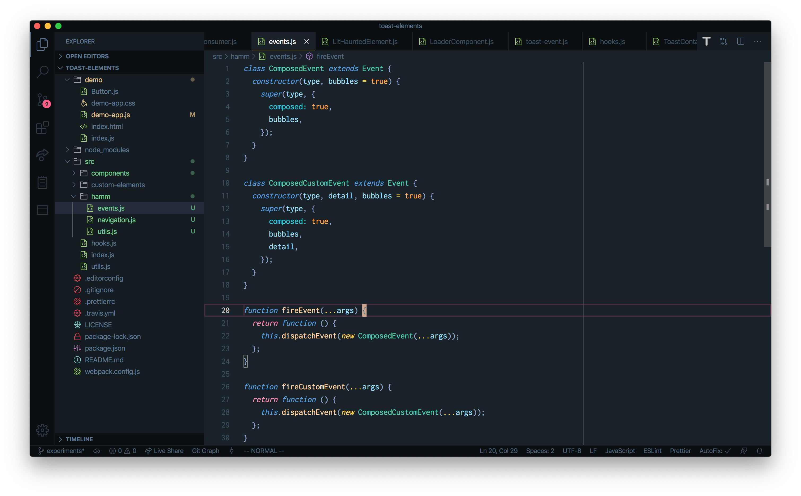
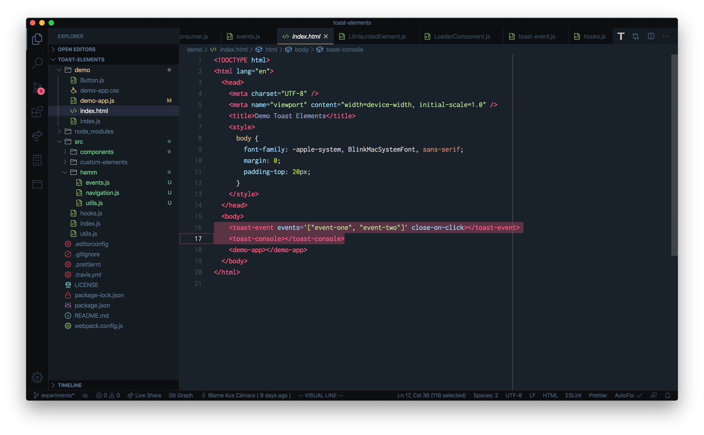
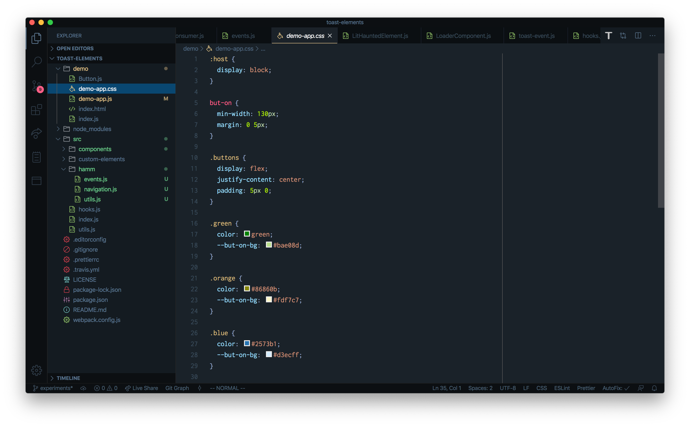
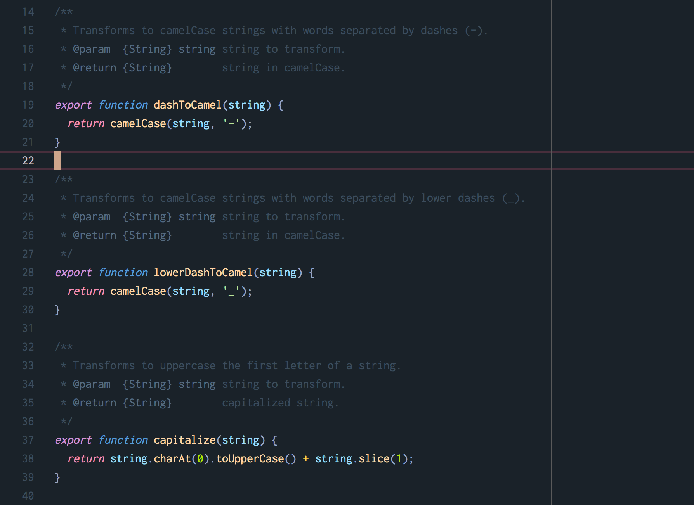

<h1 align="center">Hyper Dark Material</h1>
    

A dark VS Code Theme based on [Hyper Term Theme](https://marketplace.visualstudio.com/items?itemName=hsnazar.hyper-term-theme), Dark+ (default dark) and Material colors. 
The workbench colors are generated using [Color Your Code](https://color-your-code.firebaseapp.com/) from [Electron theme](https://marketplace.visualstudio.com/items?itemName=kuscamara.electron).

## Screenshots

**JavaScript**

**HTML**

**CSS**

**Faded comments** (no distractions)

